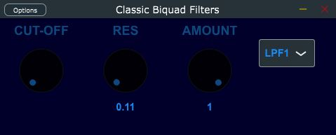
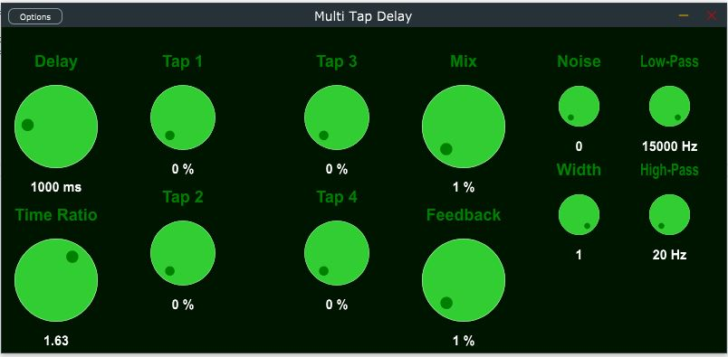
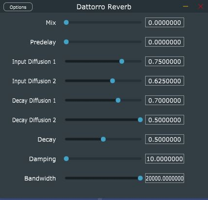

# AudioPlugins-master

_Essential plugins created during self-study from December 2023 to April 2024._
## Plugins 
Plugins created using the JUCE Framework:

### Classic Biquad Filters

A basic audio filter plugin. It operates on the digital biquad filter principle, a simple second-order recursive linear filter. This straightforward design sets the stage for implementing various other useful filter algorithms in the future.
  

### Multi Tap Delay 
 

My attempt to emulate an analog multi-tap delay with four taps, whose delay ratios are set using a simple **Time Ratio** knob. 

### Dattorro Reverb

Jon Dattorro's plate reverb algorithm. 

### Couteau Suisse
A swiss knife plugin for generating test signals. For now it only generates pink, white and brown noise. 

### Schroeder Reverb
Schroeder's 1961 Colorless Artificial Reverb Alforithm. 

## dsp_fv Library
[/dsp_fv](/dsp_fv) - My personal DSP library, housing the essential algorithmic components utilized in the plugins.

## Improvement Plan
*April 1, 2024*

**Global Tweaks, amongst others**
- Smooth out control parameter changes for a nicer user experience.
- Squash any bugs causing weird crackling sounds.
- Tidy up those I/O Bus layouts for better organization.
- Make the GUIs simpler and more user-friendly. Try some easier methods than JUCE's LookAndFeel Class.
- Make sure value labels show up right away when you start up.
- Add Licence to code.

**Classic Filters**
- Add more filter options beyond just the original four.
- Adjust the pot ranges so they feel more natural to use.
- Revisit GUI.
  
**Multi Tap Delay**
- Speed up the algorithms for smoother performance.
- Add a saturation control in the feedback path for some extra audio flavor.
- Revisit GUI.

**Dattorro Reverb**
- Simplify things by swapping out those complex Damping and Bandwidth filters with simpler biquad ones.
- Keep exploring new algorithms for a future Reverb Plugin, encompassing several algorithms. 

**Couteau Suisse**
- Add IR.
- Add sinewave generator

## Licence
[JUCE](https://github.com/juce-framework/JUCE) is used under GPLv3 license
